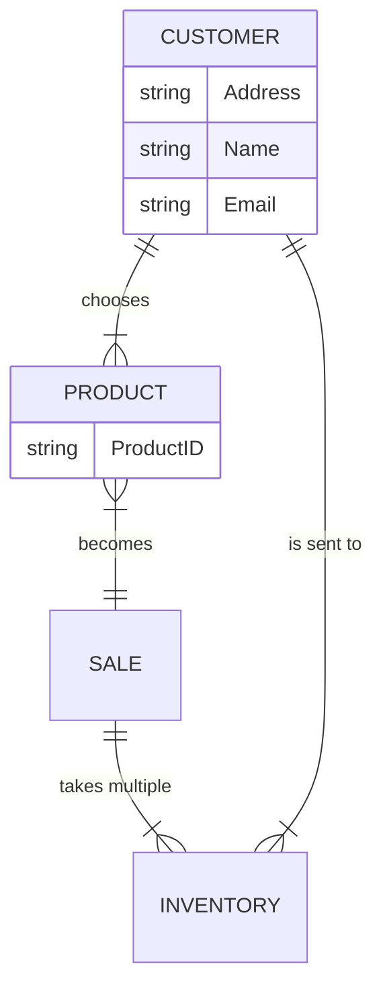

One customer (PK) chooses one or more products. The product (PK) becomes one sale (PK). This one sale (PK) takes multiple inventory. The multiple inventory then goes to the one cusotmer. The significance of the relationships to business operations is that the sale from the customer choosing product(s) leads to a sale which alerts inventory, which sends the product(s) to the customer. This is a workflow for getting a product sent to customer.
