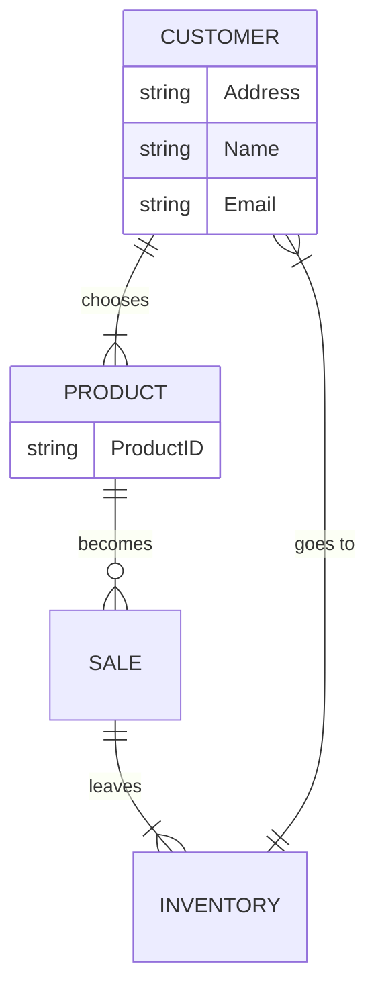

```mermaid
erDiagram
   CUSTOMER ||--|{ PRODUCT : chooses
    CUSTOMER {
        string Address
        string Name
        string Email
    }
    PRODUCT ||--o{ SALE : becomes
    PRODUCT {
        string ProductID
    }
    SALE ||--|{ INVENTORY : leaves
    INVENTORY ||--|{ CUSTOMER : "goes to"
```