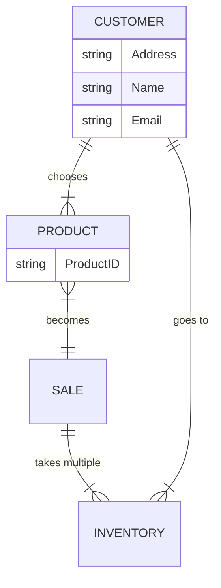

```mermaid
erDiagram
   CUSTOMER ||--|{ PRODUCT : chooses
    CUSTOMER {
        string Address
        string Name
        string Email
    }
    PRODUCT |{--|| SALE : becomes
    PRODUCT {
        string ProductID
    }
    SALE ||--|{ INVENTORY : "takes multiple"
    INVENTORY |{--|| CUSTOMER : "goes to"
```

One customer (PK) chooses one or more products. The product (PK) becomes one sale (PK). This one sale (PK) takes multiple inventory. The multiple inventory then goes to the one cusotmer.
